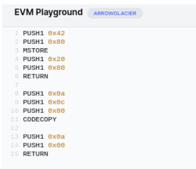
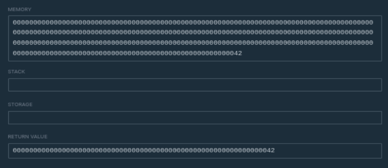

## Ethernaut Challenge 18

In this challenge the user is provided with a contract called [`Magicnumber.sol`](./Magicnumber.sol). The goal of this challenge is deploy a contract that returns '42' but only 10 opcodes are allowed no more!.

This challenge requires user to be familiar with the following concepts.
- Compiler bytecode & opcodes. For reference, [https://evm.codes](https://evm.codes)
- Create2 & Create opcodes for contract creating.
- Solidity assembly.

### Solution
1. A bytecode needs to be generated that comprises at most of 10 opcodes. A compiler when generates a bytecode it combines runtime bytecode (code that is actually stored & executed on to the blockchain) & Initialization bytecode. 

To contruct `Runtime bytecode`
```js
    PUSH1 0x42 {push 42 on stack}        // 602a
    PUSH1 0x00 {memory address to store} // 6080
    MSTORE     {store in memory}         // 51
    PUSH1 0x20 {push 32 on stack}        // 6020
    PUSH1 0x00 {push 32 on stack}        // 6000
    RETURN                               // f3

    Combined runtime bytecode `602a60805160206000f3` <br>
    Exactly 10 bytes
```
To construct `Initialization bytecode`
```js
    PUSH1 0x0a {size}               // 600a
    PUSH1 0x0c {position}           // 600a
    PUSH1 0x00 {destination}        // 600a
    RETURN                          // f3
    PUSH1 0x0a {length of code}     // 600a
    PUSH1 0x00 {Stored location}    // 6000
    RETURN                          // f3

    combined initialization bytecode `600a600a600af3600a6000f3`
```
3. Final sequence
```js
Final bytecode to deploy `0x602a60805160206000f3600a600a600af3600a6000f3`
```
4. Deploy previously crafted bytecode using the contract [`Creator`](./MagicNumber.sol) & call `setSolver()`.

1. Run Exploit!
```sh
forge test -vv -m test_challenge_18
```

### OPCODE Simulation



### Other resource related to this challenge
- [A detailed explanation of internals of solidity compiler & this challenge.](https://medium.com/coinmonks/ethernaut-lvl-19-magicnumber-walkthrough-how-to-deploy-contracts-using-raw-assembly-opcodes-c50edb0f71a2)